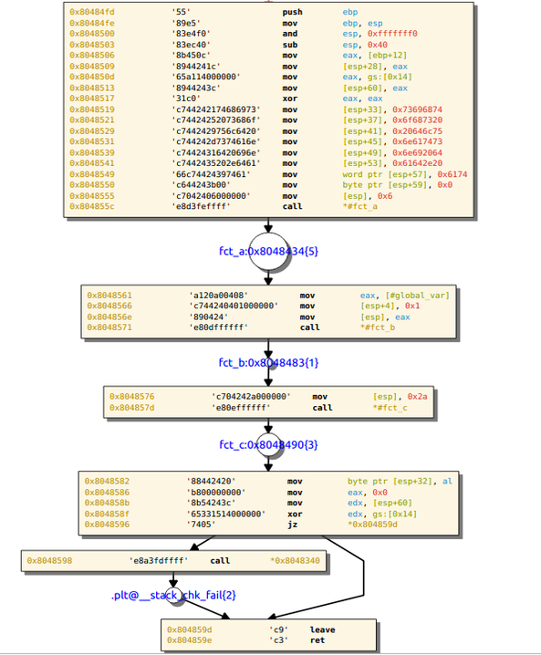

===============
Getting started
===============

The "end-user" documentation is intended for reversers or pentesters
who want to get valuable informations about a binary blob without writting
complicated python scripts.
We give here a quick introduction to amoco without covering any of the
details.

**Content**

.. contents::
    :local:

Loading binary data
===================

The recommended way to load binary data is to use the ``load_program``
function, providing an input file or string.
For example, from the directory ``amoco/tests``, do::

   In [1]: import amoco
   In [2]: p = amoco.system.loader.load_program('samples/x86/flow.elf')
   In [3]: print(p)
   <amoco.system.linux_x86.ELF object at 0x7f834b4187d0>
   In [4]: print(p.bin.Ehdr)
   ELF header:
   [Elf32_Ehdr]
   	e_ident     :ELF; ELFOSABI_SYSV; 1; ELFCLASS32; ELFDATA2LSB; 0; 127
   	e_type      :ET_EXEC
   	e_machine   :EM_386
   	e_version   :EV_CURRENT
   	e_entry     :0x8048380
   	e_phoff     :52
   	e_shoff     :4416
   	e_flags     :0x0
   	e_ehsize    :52
   	e_phentsize :32
   	e_phnum     :9
   	e_shentsize :40
   	e_shnum     :30
   	e_shstrndx  :27

If the file uses a supported executable format (currently ``PE`` of ``ELF``) and
targets a supported plateform (see :ref:`system <system>` and :ref:`arch <arch>` packages),
the returned object is an *abstraction* of the memory mapped program::

   In [5]: print(p.mmap)
   <MemoryZone rel=None :
   	 <mo [08048000,08049000] data:'\x7fELF\x01\x01\x01\x00\x00\x00...'>
   	 <mo [08049f14,08049ff0] data:'\xff\xff\xff\xff\x00\x00\x00\x0...'>
   	 <mo [08049ff0,08049ff4] data:@__gmon_start__>
   	 <mo [08049ff4,0804a000] data:'(\x9f\x04\x08\x00\x00\x00\x00\x...'>
   	 <mo [0804a000,0804a004] data:@__stack_chk_fail>
   	 <mo [0804a004,0804a008] data:@malloc>
   	 <mo [0804a008,0804a00c] data:@__gmon_start__>
   	 <mo [0804a00c,0804a010] data:@__libc_start_main>
   	 <mo [0804a010,0804af14] data:'\x00\x00\x00\x00\x00\x00\x00\x0...'>>
   <MemoryZone rel=esp :>

Note that it is also possible to provide a *raw* bytes
string as input and then manually load the suited architecture::

   In [1]: import amoco
   In [2]: shellcode = ("\xeb\x16\x5e\x31\xd2\x52\x56\x89\xe1\x89\xf3\x31\xc0\xb0\x0b\xcd"
                        "\x80\x31\xdb\x31\xc0\x40\xcd\x80\xe8\xe5\xff\xff\xff\x2f\x62\x69"
                        "\x6e\x2f\x73\x68")
   In [3]: p = amoco.system.loader.load_program(shellcode)
   amoco.system.loader: WARNING: unknown format
   amoco.system.raw: WARNING: a cpu module must be imported
   In [4]: from amoco.arch.x86 import cpu_x86
   In [5]: p.cpu = cpu_x86
   In [6]: print(p)
   <amoco.system.raw.RawExec object at 0x7f3dc3d1cef0>
   In [7]: print(p.mmap)
   <MemoryZone rel=None :
         <mo [00000000,00000024] data:'\xeb\x16^1\xd2RV\x89\xe1\x89\xf...'>>

The shellcode is loaded at address 0 by default, but can be relocated with::

   In [8]: p.relocate(0x4000)
   In [9]: print(p.mmap)
   <MemoryZone rel=None :
   	 <mo [00004000,00004024] data:'\xeb\x16^1\xd2RV\x89\xe1\x89\xf...'>>

Decoding blocks of instructions
===============================

Decoding a bytes stream as instruction needs only to load the desired cpu module, for
example::

   In [10]: cpu_x86.disassemble('\xeb\x16')
   Out[10]: <amoco.arch.x86.spec_ia32 JMP ( length=2 type=2 )>
   In [11]: print(_)
   jmp         .+22

But when a mapped binary program is available, we can start disassembling instructions
or *data* located at virtual addresses::

   In [12]: print(p.read_instruction(p.cpu.cst(0x4000,32)))
   jmp         *0x4018
   In [13]: p.read_data(p.cpu.cst(0x4000,32),2)
   Out[13]: ['\xeb\x16']

However, rather than manually adjusting the address to fetch the next instruction, we
can use any of the code analysis strategies implemented in amoco to disassemble
*basic blocks* directly::

   In [1]: import amoco
   In [2]: p = amoco.system.loader.load_program('samples/x86/flow.elf')
   In [3]: z = amoco.lsweep(p)
   In [4]: z.getblock(0x8048380)
   Out[4]: <block object (0x8048380) at 0x7f1decec4c50>
   In [5]: b=_
   In [6]: print(b.view)
   # --- block 0x8048380 ------------------------------------------
   0x8048380           '31ed'          xor         ebp, ebp
   0x8048382           '5e'            pop         esi
   0x8048383           '89e1'          mov         ecx, esp
   0x8048385           '83e4f0'        and         esp, 0xfffffff0
   0x8048388           '50'            push        eax
   0x8048389           '54'            push        esp
   0x804838a           '52'            push        edx
   0x804838b           '6810860408'    push        #__libc_csu_fini
   0x8048390           '68a0850408'    push        #__libc_csu_init
   0x8048395           '51'            push        ecx
   0x8048396           '56'            push        esi
   0x8048397           '68fd840408'    push        #main
   0x804839c           'e8cfffffff'    call        *0x8048370

Note that when a block is constructed from a mapped binary program instance,
instructions operands will possibly be represented as a symbol (provided by the program's
symbol table) or an absolute virtual address for branching instructions.

Symbolic representations of blocks
==================================

A block object provides instructions of the program located at some address in memory,
but also allows to get a symbolic functional representation of what this sequence
of instructions is doing::

   In [7]: print(b.map.view)
   eip                         <- (eip+-0x10)
   eflags:
   | cf                        <- 0x0
   | sf                        <- (((esp+0x4)&0xfffffff0)<0x0)
   | tf                        <- tf
   | zf                        <- (((esp+0x4)&0xfffffff0)==0x0)
   | pf                        <- (0x6996>>(((esp[0:8]+0x4)&0xf0)>>0x4)[0:4])[0:1]
   | of                        <- 0x0
   | df                        <- df
   | af                        <- af
   ebp                         <- 0x0
   esp                         <- (((esp+0x4)&0xfffffff0)-0x24)
   esi                         <- M32(esp)
   ecx                         <- (esp+0x4)
   (((esp+0x4)&0xfffffff0)-4)  <- eax
   (((esp+0x4)&0xfffffff0)-8)  <- (((esp+0x4)&0xfffffff0)-0x4)
   (((esp+0x4)&0xfffffff0)-12) <- edx
   (((esp+0x4)&0xfffffff0)-16) <- 0x8048610
   (((esp+0x4)&0xfffffff0)-20) <- 0x80485a0
   (((esp+0x4)&0xfffffff0)-24) <- (esp+0x4)
   (((esp+0x4)&0xfffffff0)-28) <- M32(esp)
   (((esp+0x4)&0xfffffff0)-32) <- 0x80484fd
   (((esp+0x4)&0xfffffff0)-36) <- (eip+0x21)

Here we are with the *map* of the previous block.
Now what this mapper object says is for example that once the block is executed ``esi`` register
will be set to the 32 bits value pointed by ``esp``, that the carry flag will be 0, or
that the top of the stack will hold value ``eip+0x21``.
Rather than extracting the entire view of the mapper we can query any expression out if it::

   In [8]: print(b.map(p.cpu.ecx))
   (esp+0x4)

There are some caveats when it comes to query memory expressions but we will leave this
for later (see :class:`mapper` class).

The ``b.map`` object also provides a better way to see how the memory is modified by the block::

   In [9]: print(b.map.memory())
   <MemoryZone rel=None :>
   <MemoryZone rel=((esp+0x4)&0xfffffff0) :
         <mo [-0000024,-0000020] data:(eip+0x21)>
         <mo [-0000020,-000001c] data:0x80484fd>
         <mo [-000001c,-0000018] data:M32(esp)>
         <mo [-0000018,-0000014] data:(esp+0x4)>
         <mo [-0000014,-0000010] data:0x80485a0>
         <mo [-0000010,-000000c] data:0x8048610>
         <mo [-000000c,-0000008] data:edx>
         <mo [-0000008,-0000004] data:(((esp+0x4)&0xfffffff0)-0x4)>
         <mo [-0000004,00000000] data:eax>>

The :class:`mapper` is an essential element of amoco that captures the semantics of the block by
interpreting the block's instructions in a symbolic way. Note that it takes no input state
or whatever but just expresses what the block would do independently of what has been done
before and even where the block is actually located.

For any mapper object, we can get the lists of input and output expressions, and replace
any inputs by another chosen expression::

   In [10]: for x in set(b.map.inputs()): print(x)
   eip
   esp
   esp[0:8]
   eax
   edx
   M32(esp)
   In [11]: m = b.map.use(eip=0x8048380, esp=0x7fcfffff)
   In [12]: print(m.view)
   eip             <- 0x8048370
   eflags:
   | cf            <- 0x0
   | sf            <- 0x0
   | tf            <- tf
   | zf            <- 0x0
   | pf            <- 0x0
   | of            <- 0x0
   | df            <- df
   | af            <- af
   ebp             <- 0x0
   esp             <- 0x7fcfffdc
   esi             <- M32(0x7fcfffff)
   ecx             <- 0x7fd00003
   (0x7fd00000-4)  <- eax
   (0x7fd00000-8)  <- 0x7fcffffc
   (0x7fd00000-12) <- edx
   (0x7fd00000-16) <- 0x8048610
   (0x7fd00000-20) <- 0x80485a0
   (0x7fd00000-24) <- 0x7fd00003
   (0x7fd00000-28) <- M32(0x7fcfffff)
   (0x7fd00000-32) <- 0x80484fd
   (0x7fd00000-36) <- 0x80483a1

Its fine to disassemble a block at some address and get some symbolic representation of it,
but we are still far from getting the picture of the entire program.
In order to reason later about execution paths, we need a way to *chain* block mappers.
This is provided by the mapper's shifts operators::

   In [13]: mm = amoco.cas.mapper.mapper()
   In [14]: mm.assume_no_aliasing = True
   In [15]: mm[p.cpu.eip] = p.cpu.mem(p.cpu.esp+4,32)
   In [16]: print( (m>>mm)(p.cpu.eip) )
   0x80484fd

Here, taking a new mapper as if it came either from a block or a stub, and assuming
that there is no memory aliasing, the execution of m followed by mm would branch to
address 0x80484fd (#main).

Starting some analysis
======================

Now that we can evaluate a path of blocks, we can get some insights about the expressions of
registers or memory locations along a chosen path. This kind of evaluation however requires a
known *control flow graph* (CFG) of the studied function path.

There are several strategies to build the control flow graph of a program
(i.e. the CFG's of all its functions) but none is perfect.
Some strategies are implemented in module :ref:`main <main>`, ranging from the simple
:class:`lsweep` linear sweep method to a *link backward* method (see :class:`lbackward`)
that evaluates the program's counter in backward until either a concrete value is obtained or
the root node of the current CFG is reached::

   In [1]: import amoco
   In [2]: p = amoco.system.loader.load_program('samples/x86/flow.elf')
   In [3]: amoco.set_log_all('VERBOSE')
   In [4]: z = amoco.lbackward(p)
   In [5]: z.getcfg()
   amoco.main: VERBOSE: root node 0x8048380 added
   amoco.main: VERBOSE: block 0x8048370 starts a new cfg component
   amoco.cas.expressions: INFO: stub __libc_start_main implicit call
   amoco.main: INFO: lbackward analysis stopped at node @__libc_start_main
   amoco.main: INFO: lbackward: function 0x8048370{2} done
   amoco.main: VERBOSE: edge 0x8048380 ---> .plt@__libc_start_main added
   amoco.main: VERBOSE: block 0x80484fd starts a new cfg component
   amoco.main: VERBOSE: block 0x8048434 starts a new cfg component
   amoco.main: VERBOSE: block 0x8048483 starts a new cfg component
   amoco.main: INFO: lbackward analysis stopped at node 0x8048483
   amoco.main: INFO: lbackward: function 0x8048483{1} done
   amoco.main: VERBOSE: edge 0x8048434 ---> fct_b:0x8048483 added
   amoco.main: VERBOSE: edge fct_b:0x8048483 ---> 0x804845e added
   amoco.main: VERBOSE: block 0x80484d4 starts a new cfg component
   amoco.main: INFO: lbackward analysis stopped at node 0x80484d4
   amoco.main: INFO: lbackward: function 0x80484d4{1} done
   amoco.main: VERBOSE: edge 0x804845e ---> fct_e:0x80484d4 added
   amoco.main: VERBOSE: edge fct_e:0x80484d4 ---> 0x804846d added
   amoco.main: INFO: lbackward analysis stopped at node 0x804846d
   amoco.main: INFO: lbackward: function 0x8048434{5} done
   amoco.main: VERBOSE: edge 0x80484fd ---> fct_a:0x8048434 added
   amoco.main: VERBOSE: edge fct_a:0x8048434 ---> 0x8048561 added
   amoco.main: VERBOSE: function fct_b:0x8048483{1} called
   amoco.main: VERBOSE: extending cfg of 0x80484fd{4} (new target found)
   amoco.main: VERBOSE: edge fct_b:0x8048483 ---> 0x8048576 added
   amoco.main: VERBOSE: block 0x8048490 starts a new cfg component
   amoco.main: VERBOSE: block 0x80484ab starts a new cfg component
   amoco.main: VERBOSE: block 0x8048350 starts a new cfg component
   amoco.cas.expressions: INFO: stub malloc implicit call
   amoco.main: INFO: lbackward analysis stopped at node @malloc
   amoco.main: INFO: lbackward: function 0x8048350{2} done
   amoco.main: VERBOSE: edge 0x80484ab ---> .plt@malloc added
   amoco.main: VERBOSE: edge .plt@malloc ---> 0x80484c4 added
   amoco.main: INFO: lbackward analysis stopped at node 0x80484c4
   amoco.main: INFO: lbackward: function 0x80484ab{3} done
   amoco.main: VERBOSE: edge 0x8048490 ---> fct_d:0x80484ab added
   amoco.main: VERBOSE: edge fct_d:0x80484ab ---> 0x80484a1 added
   amoco.main: INFO: lbackward analysis stopped at node 0x80484a1
   amoco.main: INFO: lbackward: function 0x8048490{3} done
   amoco.main: VERBOSE: edge 0x8048576 ---> fct_c:0x8048490 added
   amoco.main: VERBOSE: edge fct_c:0x8048490 ---> 0x8048582 added
   amoco.main: VERBOSE: edge 0x8048582 -?-> 0x804859d added
   amoco.main: INFO: lbackward analysis stopped at node 0x804859d
   amoco.main: VERBOSE: edge 0x8048582 -?-> 0x8048598 added
   amoco.main: VERBOSE: block 0x8048340 starts a new cfg component
   amoco.cas.expressions: INFO: stub __stack_chk_fail implicit call
   amoco.main: INFO: lbackward analysis stopped at node @__stack_chk_fail
   amoco.main: INFO: lbackward: function 0x8048340{2} done
   amoco.main: VERBOSE: edge 0x8048598 ---> .plt@__stack_chk_fail added
   amoco.main: VERBOSE: edge .plt@__stack_chk_fail ---> 0x804859d added
   amoco.cas.expressions: VERBOSE: invalid mapper eval: cond 0x0 is false
   amoco.code: VERBOSE: link 0x8048582 -?-> 0x8048598 ignored
   amoco.main: INFO: lbackward: function 0x80484fd{10} done
   amoco.main: VERBOSE: edge .plt@__libc_start_main ---> f:0x80484fd added
   amoco.cas.expressions: INFO: stub exit implicit call
   amoco.main: INFO: lbackward analysis stopped at node @exit
   amoco.main: INFO: lbackward: function 0x8048380{4} done
   Out[5]: <amoco.cfg.graph at 0x7f587a815080>

Here we use the :class:`lbackward` strategy to build the CFG of the very simple ``flow.elf``
x86 sample program. This strategy does *not* assume that a call will return and
thus follows strictly the program's counter value. The CFG is build as a :class:`cfg.graph`
instance (which inherits from the :ref:`grandalf.graphs.Graph` class.)

As shown by adjusting log messages to a more verbose level, the ``getcfg`` method starts from
the entrypoint (here 0x8048370) and creates new cfg components whenever a function call is made.
Each new graph component is a candidate for a :class:`code.func` object once
all paths have reached a function's *end*.
The collected functions created during the analysis are listed in::

   In [6]: z.functions
   Out[6]:
   [<func object (_start) at 0x7f58740244c8>,
    <func object (.plt@__libc_start_main) at 0x7f587a6a86a8>,
    <func object (f:0x80484fd) at 0x7f5874013ca8>,
    <func object (fct_a:0x8048434) at 0x7f58740242e8>,
    <func object (fct_b:0x8048483) at 0x7f58740130a8>,
    <func object (fct_e:0x80484d4) at 0x7f58740139a8>,
    <func object (fct_c:0x8048490) at 0x7f5874075b28>,
    <func object (fct_d:0x80484ab) at 0x7f5874075468>,
    <func object (.plt@malloc) at 0x7f5874024588>,
    <func object (.plt@__stack_chk_fail) at 0x7f5874013a08>]
   In [7]: f = z.functions[4]
   In [8]: print(f.name)
   fct_b:0x8048483
   In [9]: print(f.cfg.sV)
   0.| <node [0x8048483] at 0x7f3af028e7f0>
   In [10]: n = f.cfg.sV[0]
   In [11]: print(n.view)
   # --- block 0x8048483 -----------------------------------
   0x8048483           '55'        push        ebp
   0x8048484           '89e5'      mov         ebp, esp
   0x8048486           '8b450c'    mov         eax, [ebp+12]
   0x8048489           '8b5508'    mov         edx, [ebp+8]
   0x804848c           '01d0'      add         eax, edx
   0x804848e           '5d'        pop         ebp
   0x804848f           'c3'        ret
   In [12]: print(n.data.map.view)
   eip     <- M32(esp)
   esp     <- (esp+0x4)
   (esp-4) <- ebp
   ebp     <- ebp
   eax     <- (M32(esp+8)+M32(esp+4))
   edx     <- M32(esp+4)
   eflags:
   | cf    <- ((M8(esp+11)[7:8]∧M8(esp+7)[7:8])∨((⌐(M32(esp+8)+M32(esp+4))[31:32])∧(M8(esp+11)[7:8]∨M8(esp+7)[7:8])))
   | of    <- ((M8(esp+11)[7:8]⊕(M32(esp+8)+M32(esp+4))[31:32])∧(M8(esp+7)[7:8]⊕(M32(esp+8)+M32(esp+4))[31:32]))
   | df    <- df
   | sf    <- ((M32(esp+8)+M32(esp+4))<0x0)
   | tf    <- tf
   | zf    <- ((M32(esp+8)+M32(esp+4))==0x0)
   | af    <- ⊤1
   | pf    <- ⊤1

A function's CFG can be walked and studied by accessing its graph component. The ``sV`` attribute
is the list of unique nodes (vertices) and ``sE`` the list of *links* (edges) of the CFG.
The CFG can be rendered for example in a Qt GUI with::

   In [13]: from amoco.ui.graphics.qt_.engine import *
   In [14]: amoco.ui.graphics.configure(graphics="qt")
   In [15]: f = z.functions[2]
   In [16]: gs = GraphScene(f.view.layout)
   In [17]: gv = GraphView(gs)
   In [18]: gs.Draw()
   In [19]: gv.show()

As shown below, once the "qt" ui is selected we can build a *QGraphicsScene* and *QGraphicsView*
to display the CFG of ``#main``:

